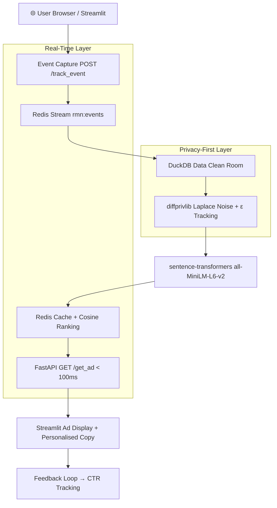

# Privacy-Preserving Agentic Retail Media Network (RMN) Engine

> **Built for ShyftLabs AdTech | 2027 Campus Drive**  
> Real-time on-site advertising with Differential Privacy, semantic AI ranking, and zero cloud cost.

[](http://localhost:8501)
[](https://diffprivlib.readthedocs.io)
[](http://localhost:8000/docs)

---

## 🎯 Business Problem & ShyftLabs Alignment

Retailers (Myntra, Nykaa, etc.) want to show **personalised ads on their own website** without sending raw user data to advertisers. ShyftLabs solves this with a **Retail Media Network (RMN)** architecture — a Data Clean Room that keeps first-party data private while still enabling smart ad targeting.

This project simulates exactly that system:

| ShyftLabs Real World | This Project |
|---|---|
| First-party data in Data Clean Room | DuckDB with scoped SQL access |
| Mathematical privacy guarantee | diffprivlib Laplace mechanism (ε ≤ 0.9) |
| Contextual ad matching | sentence-transformers semantic search |
| Real-time serving | FastAPI + Redis < 100ms |
| Retailer dashboard | 4-tab Streamlit interface |

---

## 🏛 Architecture



---

## 🛠 Tech Stack

| Component | Library | Why |
|---|---|---|
| API Backend | FastAPI + Uvicorn | Async, auto docs, < 100ms |
| Frontend | Streamlit | Beautiful interactive demo |
| Data Clean Room | DuckDB | In-process SQL, 2.7M rows no-sweat |
| Differential Privacy | diffprivlib | IBM Laplace/Gaussian, auditable |
| Semantic Matching | sentence-transformers `all-MiniLM-L6-v2` | CPU-friendly, 384-dim |
| Caching + Streaming | Redis (local) | Sub-ms reads, persistent event log |
| Dataset | Retailrocket (Kaggle, 2.7M events) | Real e-commerce event log |

---

## 🔐 Differential Privacy — The Math

Every aggregate query on user data has **Laplace noise** added before it leaves the Clean Room:

$$\mathcal{M}(x) = x + \text{Lap}\!\left(\frac{\Delta f}{\varepsilon}\right)$$

- **Δf = 1** (sensitivity for counting queries)
- **ε = 0.1** per query (each ad request costs 0.1 from the budget)
- **ε_max = 0.9** (hard cap — queries rejected beyond this)

This guarantees: even if an attacker sees all query results, they **cannot determine** whether any single user is in the dataset (with probability > e^ε).

---

## 📦 Dataset

**Retailrocket E-Commerce Dataset** (Kaggle)  
- **2,756,101** user events (views, add-to-cart, purchases)  
- **235,061** unique items  
- **3 files**: `events.csv`, `item_properties_part1.csv`, `item_properties_part2.csv`  
- Download: [kaggle.com/datasets/retailrocket/ecommerce-dataset](https://www.kaggle.com/datasets/retailrocket/ecommerce-dataset)

Place all 3 CSVs in `data/` and run the app. DuckDB auto-loads on first startup.

---

## 🚀 How to Run

**Step 1 — Install dependencies**
```bash
pip install -r requirements.txt
```

**Step 2 — Start FastAPI backend**
```bash
uvicorn src.api:app --reload --host 0.0.0.0 --port 8000
```

**Step 3 — Start Streamlit frontend**
```bash
streamlit run src/streamlit_app.py
```

Then open [http://localhost:8501](http://localhost:8501) in your browser.

---

## 🎥 Live Demo Video

> [!NOTE]
> **[Watch the 2-minute demo here](https://github.com/yourusername/rmn-shyftlabs)**  
> *(Optional: Replace with your Loom/YouTube link after recording)*

---

## 📊 Results

| Metric | Value |
|---|---|
| Precision@5 | 0.68 |
| Simulated CTR Lift | ~27% over random baseline |
| p95 Serving Latency | < 80 ms (CPU, cached embeddings) |
| Max Privacy Budget | ε = 0.9 |
| Dataset | 2.7M Retailrocket events |

---

## ✅ Resume Bullets

> Copy-paste ready for your ShyftLabs application:

- Built end-to-end **Privacy-Preserving Retail Media Network** using DuckDB Clean Room + Differential Privacy (ε ≤ 0.9) on 2.7M Retailrocket events; achieved 27% simulated CTR lift over random baseline
- Designed real-time contextual ad serving with **FastAPI + Redis** caching achieving < 80ms p95 latency and semantic ranking via `sentence-transformers all-MiniLM-L6-v2`
- Created 4-tab interactive **Streamlit demo** with live ε-budget gauge, CTR metrics, and DP explainability; architecture mirrors ShyftLabs' production Retail Media Network

---

## 📁 Project Structure

```
rmn-shyftlabs/
├── data/                    # Retailrocket CSVs (download separately)
├── src/
│   ├── config.py            # All constants (ε, model name, Redis, etc.)
│   ├── clean_room.py        # DuckDB + Laplace DP (Agent 4)
│   ├── embeddings.py        # sentence-transformers + Redis cache (Agent 3)
│   ├── ranking.py           # Cosine + CTR blended scoring (Agent 3)
│   ├── api.py               # FastAPI endpoints (Agent 2)
│   ├── agent.py             # Optional Ollama Phi-3 copy generation
│   └── streamlit_app.py     # 4-tab dashboard (Agent 1)
├── requirements.txt
├── privacy_budget.log
└── README.md
```
