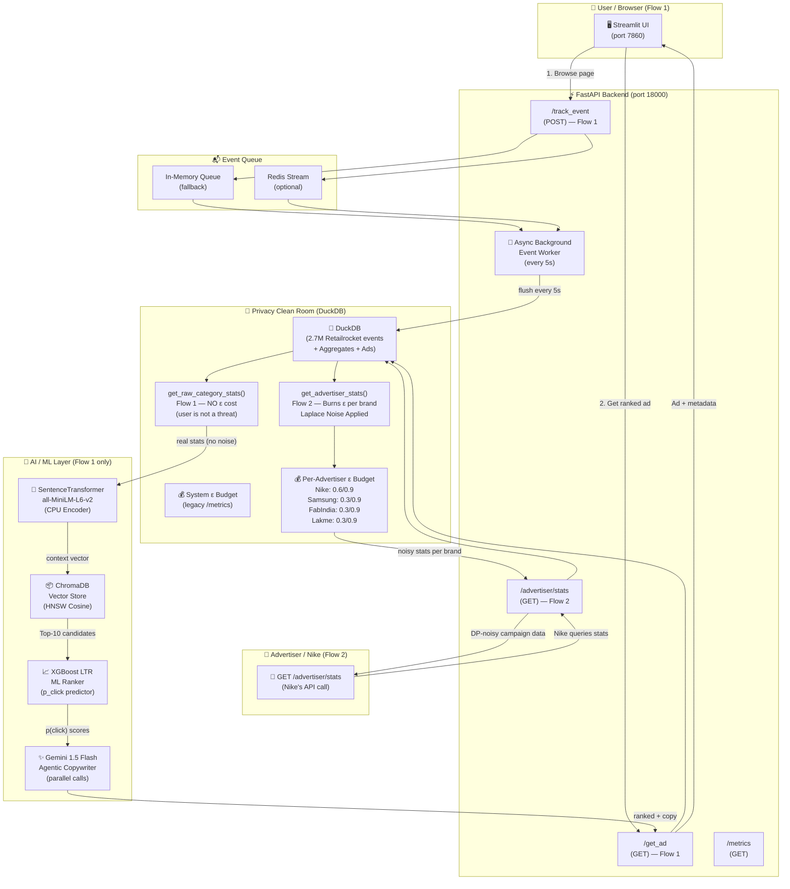
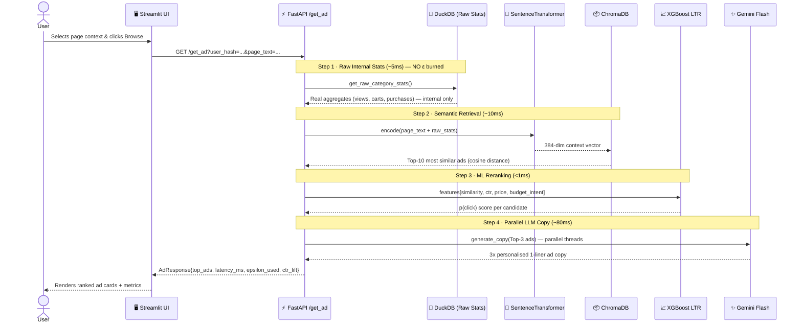
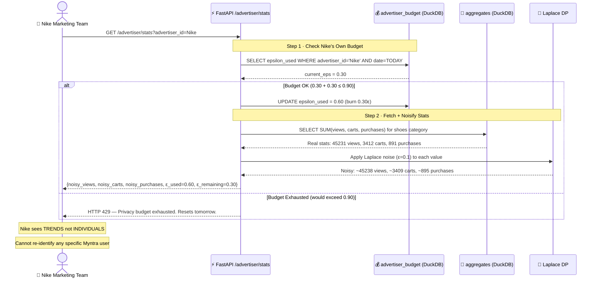
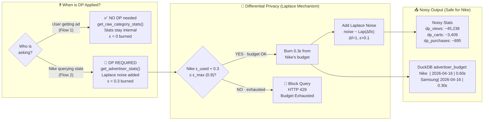
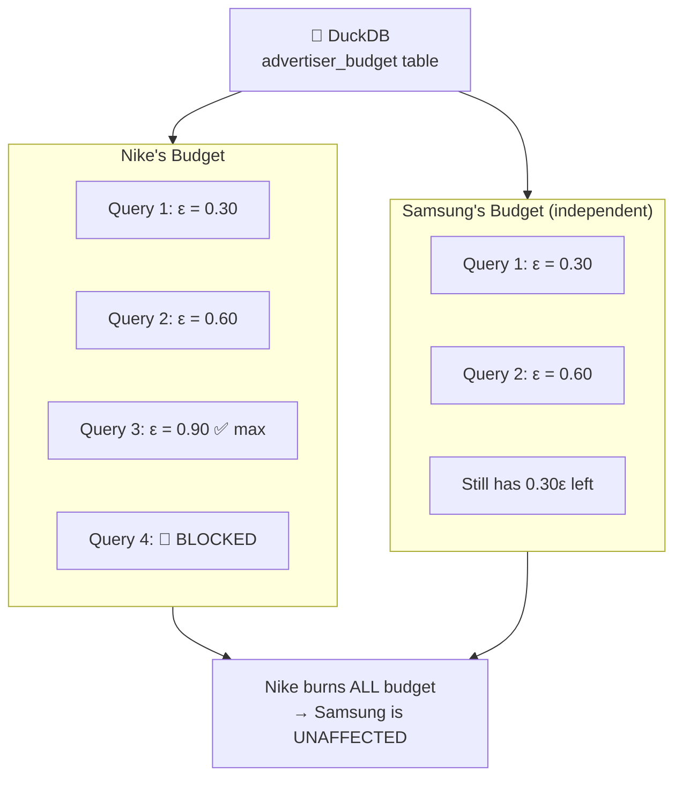
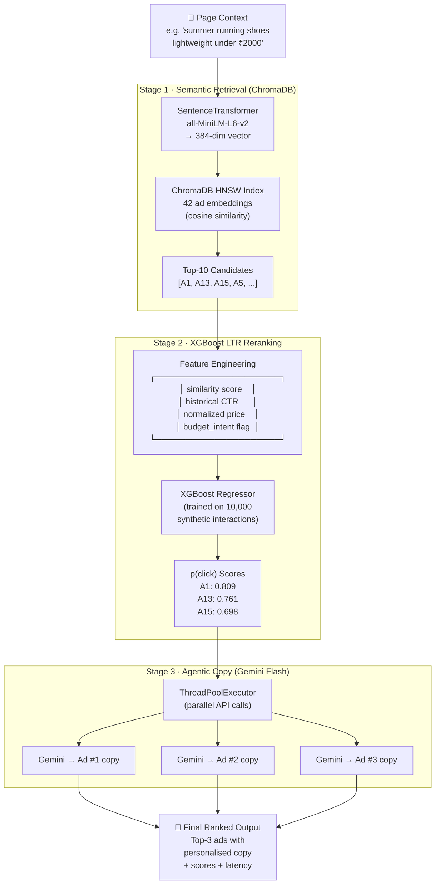
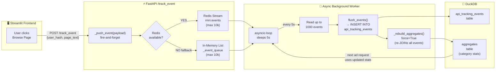
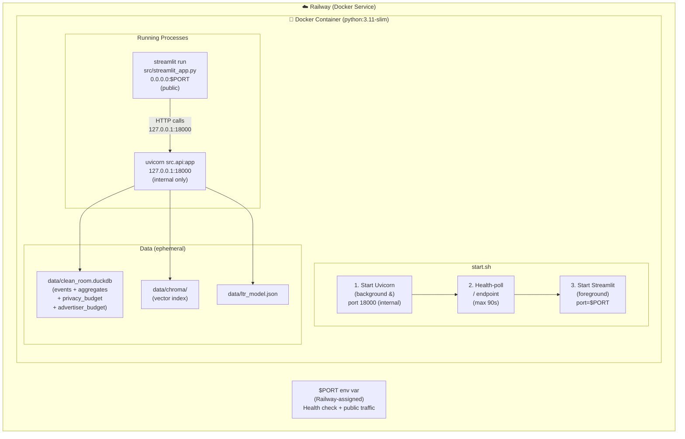

# 🛒 Privacy-Preserving Agentic Retail Media Network (RMN) Engine

> **Built for ShyftLabs AdTech**
> Real-time on-site advertising with Differential Privacy (DuckDB), Vector Search (ChromaDB), **XGBoost ML Ranking**, and **Agentic LLM Copywriting** (Gemini Flash).

[](https://rmn-engine.up.railway.app)
[](https://diffprivlib.readthedocs.io)
[](http://localhost:8000/docs)
[](https://python.org)
[](https://fastapi.tiangolo.com)

---

## 🎯 Business Problem & ShyftLabs Alignment

Retailers (Myntra, Nykaa, etc.) want to show **personalised ads on their own website** without sending raw user data to advertisers. ShyftLabs solves this with a **Retail Media Network (RMN)** architecture — a Data Clean Room that keeps first-party data private while enabling smart ad targeting.

| ShyftLabs Real World | This Project Architecture |
|---|---|
| First-party Data Clean Room | **DuckDB** Async Background Worker (Scalable Flush) |
| Mathematical privacy guarantee | **diffprivlib Laplace** mechanism (Persistent DuckDB tracking) |
| Contextual / Semantic match | **ChromaDB** Vector Engine (`all-MiniLM-L6-v2`) |
| Real-time CTR Prediction | **XGBoost** Learning-to-Rank (LTR) |
| Ad Copy Personalization | **Gemini 1.5 Flash** Agentic generation |
| Advertiser Reporting | **Per-advertiser ε budget** isolated per brand |

---

## 🏗️ The Two Flows — Core Architecture Concept

This system handles **two completely separate flows** that must never be confused:

```
┌─────────────────────────────────────────────────────────────────┐
│  FLOW 1 — Ad Serving (User Side)                                │
│                                                                  │
│  User browses Myntra → RMN Engine picks best ad → User sees ad  │
│  Uses: get_raw_category_stats()  ← NO epsilon burned            │
│  Why: The user is not a threat. Stats stay internal.            │
└─────────────────────────────────────────────────────────────────┘

┌─────────────────────────────────────────────────────────────────┐
│  FLOW 2 — Advertiser Reporting (Nike Side)                      │
│                                                                  │
│  Nike queries Myntra → Clean Room returns NOISY stats → Nike    │
│  Uses: get_advertiser_stats()    ← Burns Nike's own ε budget    │
│  Why: Nike IS a threat. DP prevents user re-identification.     │
└─────────────────────────────────────────────────────────────────┘
```

---

## 🗺️ Diagram 1 — Master System Architecture

**The complete end-to-end picture: both flows, every component.**



---

## 🔄 Diagram 2 — Flow 1: Ad Request (User Sees Ad)

**What happens in `< 150ms` when a user clicks "Browse Page & Get Ad".**



---

## 📡 Diagram 3 — Flow 2: Advertiser Reporting (Nike Queries Stats)

**What happens when Nike calls the advertiser API.**



---

## 🔐 Diagram 4 — Differential Privacy Pipeline (Updated)

**How user data is protected — and WHERE it applies.**



---

## 🏢 Diagram 5 — Per-Advertiser Budget Isolation

**Each brand has their own daily ε quota — completely independent.**



---

## 🤖 Diagram 6 — ML Ranking Pipeline (Flow 1)

**Three-stage AI pipeline: Vector Search → XGBoost Reranking → LLM Copy.**



---

## 📬 Diagram 7 — Event Ingestion Pipeline

**How user browsing events are asynchronously captured and stored.**



---

## 🐳 Diagram 8 — Deployment Architecture

**How the project runs inside a single Docker container on Railway.**



---

## 🛠 Tech Stack

| Component | Technology | Why |
|---|---|---|
| API Backend | **FastAPI + Uvicorn** | Async execution, background task ingestion |
| Data Clean Room | **DuckDB** | Lightning-fast OLAP on 2.7M rows, persistent DP budget |
| ML Ranking | **XGBoost Regressor** | Learning-to-Rank `p(click)` probability |
| Vector Engine | **ChromaDB (HNSW)** | Scalable cosine similarity, <10ms at 10,000+ ads |
| Agentic LLM | **Gemini 1.5 Flash** | Near-instant hyper-personalized ad copy |
| Embeddings | **all-MiniLM-L6-v2** | CPU-efficient 384-dim sentence embeddings |
| Differential Privacy | **diffprivlib** | IBM Laplace mechanism, persistent daily ε budget |
| Dataset | **Retailrocket (Kaggle)** | 2.7M real e-commerce events |
| Frontend | **Streamlit** | Live demo UI with dark glassmorphism theme |
| Deployment | **Docker + Railway** | Single-container deployment with auto-scaling & $PORT routing |

---

## ⚡ Scale & Performance

| Metric | Target | How |
|---|---|---|
| **Ad Retrieval** | < 10ms | ChromaDB HNSW approximate nearest neighbor |
| **ML Reranking** | < 1ms | XGBoost compiled model (`ltr_model.json`) |
| **LLM Copy** | ~80ms | Parallel Gemini Flash calls via ThreadPoolExecutor |
| **End-to-End** | < 150ms p95 | Async FastAPI + cached embeddings |
| **Catalog Scale** | 10,000+ ads | HNSW index with zero latency degradation |
| **User Ad Requests** | Unlimited/day | Flow 1 uses raw stats — no ε cost |
| **Advertiser Queries** | 3/day per brand | Flow 2 burns 0.3ε per query, max 0.9ε |

---

## 🔐 Differential Privacy Math

Every aggregate query on user data (Flow 2 only) has **Laplace noise** mathematically injected:

$$\mathcal{M}(x) = x + \text{Lap}\!\left(\frac{\Delta f}{\varepsilon}\right)$$

- **ε = 0.1** per noise application (3 noisy values = 0.3ε per advertiser query)
- **ε_max = 0.9** — queries are hard-blocked beyond this
- **Per-advertiser budget** — Nike's queries don't consume Samsung's budget
- **Attack Protection:** The `ε_used` state is stored **persistently in DuckDB** in `advertiser_budget` table. A malicious attacker cannot restart the server to restore budget.

### Why DP only in Flow 2 (not Flow 1)?

```
Flow 1 (User → Ad):
  Stats are used INTERNALLY by the ML pipeline only.
  They never leave the system. The user is not a threat.
  → Raw stats, zero ε cost, unlimited requests.

Flow 2 (Nike → Stats):
  Stats are RETURNED to an external party (Nike).
  Nike could run difference attacks to identify users.
  → Noisy stats, 0.3ε per query, hard cap at 0.9ε/day.
```

---

## 📡 API Reference

### Flow 1 — Ad Serving

| Endpoint | Method | Purpose | ε Cost |
|---|---|---|---|
| `/` | GET | Health check | 0 |
| `/healthz` | GET | Railway health probe | 0 |
| `/track_event` | POST | Log user browsing event (fire-and-forget) | 0 |
| `/get_ad` | GET | Return ranked personalised ad | **0** (uses raw stats) |
| `/metrics` | GET | System-level CTR lift + budget stats | 0 |

### Flow 2 — Advertiser Reporting

| Endpoint | Method | Purpose | ε Cost |
|---|---|---|---|
| `/advertiser/stats` | GET | Return DP-noisy campaign stats for one advertiser | **0.3ε per call** |

#### `/advertiser/stats` Request
```
GET /advertiser/stats?advertiser_id=Nike&retailer=Myntra
```

#### `/advertiser/stats` Response
```json
{
  "advertiser_id":     "Nike",
  "category":          "shoes",
  "noisy_views":       45238,
  "noisy_carts":       3409,
  "noisy_purchases":   895,
  "cart_rate_pct":     7.53,
  "purchase_rate_pct": 1.97,
  "epsilon_used":      0.60,
  "epsilon_remaining": 0.30,
  "epsilon_max":       0.90,
  "dp_noise_applied":  true
}
```

#### Error: Budget Exhausted
```
HTTP 429 Too Many Requests
{"detail": "[Nike] Privacy budget exhausted: ε=0.90 + 0.3 > 0.9"}
```

---

## 🎮 Demo Advertisers

| Advertiser | Category | Ad IDs | Brand Color |
|---|---|---|---|
| **Nike** | Shoes | A1, A5, A9, A13, A14, A15, A16, A17 | #f97316 (Orange) |
| **Samsung** | Electronics | A2, A6, A10, A19–A24 | #3b82f6 (Blue) |
| **FabIndia** | Ethnic Wear | A3, A7, A25–A30 | #f59e0b (Amber) |
| **Lakme** | Skincare | A4, A8, A31–A36 | #ec4899 (Pink) |

---

## 🚀 Local Run Instructions

**Step 1 — Clone & install dependencies**
```bash
git clone https://github.com/shubhamkya/rmn-engine
cd rmn-engine
pip install -r requirements.txt
```

**Step 2 — Set API Key**
```env
GEMINI_API_KEY=your_gemini_api_key_here
```

**Step 3 — One-command startup**
```bash
./start.sh
```

| Service | URL |
|---|---|
| 🖥️ Streamlit UI | http://localhost:7860 |
| ⚙️ FastAPI Swagger | http://localhost:18000/docs |

---

## 📁 Repository Structure

```
rmn-engine/
├── data/
│   ├── clean_room.duckdb        # DuckDB (2.7M events + aggregates + ε budgets)
│   ├── ltr_model.json           # Trained XGBoost model
│   └── chroma/                  # ChromaDB vector index (42 ad embeddings)
│
├── src/
│   ├── config.py                # 🔧 Constants, API keys, ad catalogue, ADVERTISER_CATALOGUE
│   ├── api.py                   # ⚡ FastAPI — /get_ad, /track_event, /advertiser/stats
│   ├── clean_room.py            # 🦆 DuckDB schema, raw stats, DP stats, per-advertiser budget
│   ├── embeddings.py            # 🧠 SentenceTransformer + ChromaDB integration
│   ├── ltr.py                   # 📈 XGBoost LTR trainer & inference
│   ├── ranking.py               # 🎯 Full ranking pipeline (Chroma → XGB → LLM)
│   ├── agent.py                 # ✨ Gemini Flash agentic copy generation
│   └── streamlit_app.py         # 🖥️ 5-tab Streamlit dashboard
│
├── Dockerfile                   # 🐳 Railway Docker container
├── start.sh                     # 🚀 Startup orchestration script
├── requirements.txt             # 📦 Python dependencies
└── README.md
```

---

## 📊 Data Flow Summary

### Flow 1 — User Receives Ad
```
User browses "summer running shoes under ₹2000"
      │
      ├──► POST /track_event ──► Queue ──► [every 5s] ──► DuckDB
      │
      └──► GET /get_ad
                │
                ├─► DuckDB get_raw_category_stats() ─► Real stats (NO noise, NO ε)
                │                                             │
                ├─────────────────────────────────────────────┤
                │                                             ▼
                │                                   SentenceTransformer
                │                                   (encode context vector)
                │                                             │
                │                                             ▼
                │                                   ChromaDB HNSW Query
                │                                   (Top-10 semantic matches)
                │                                             │
                │                                             ▼
                │                                   XGBoost LTR Scoring
                │                                   (p(click) per candidate)
                │                                             │
                │                                    ┌────────┴────────┐
                │                                    ▼                 ▼
                │                              Gemini #1          Gemini #2,3
                │                              (parallel copy generation)
                │                                    └────────┬────────┘
                │                                             │
                ◄─────────────────────────────────────────────┘
                        Top-3 Ranked Ads + Personalised Copy
```

### Flow 2 — Nike Checks Campaign Performance
```
Nike calls: GET /advertiser/stats?advertiser_id=Nike
      │
      └──► DuckDB advertiser_budget: check Nike's ε used today
                │
                ├─ [0.60 + 0.30 = 0.90 ≤ 0.90] → OK
                │         Burn 0.30ε from Nike's budget → persist to DuckDB
                │
                ├─► DuckDB aggregates: fetch real views/carts/purchases
                │
                ├─► Laplace noise applied to each value
                │         views:     45231 + Lap(10) = 45238
                │         carts:     3412  + Lap(10) = 3409
                │         purchases: 891   + Lap(10) = 895
                │
                └──► Nike sees noisy stats (useful for bidding, safe for users)
                         ε_used=0.60, ε_remaining=0.30, queries_left=1
```
