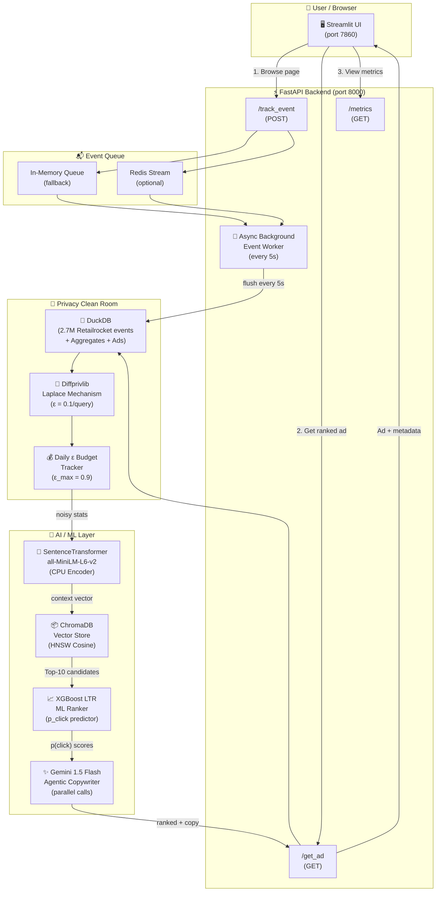
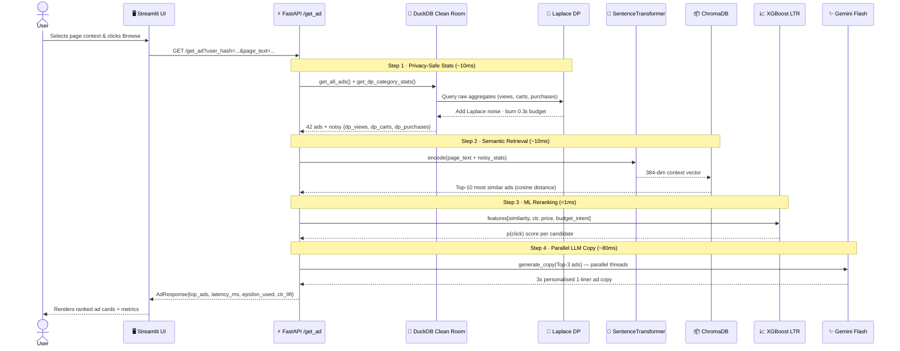
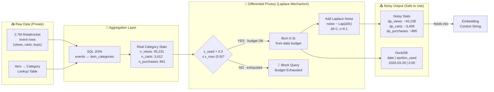
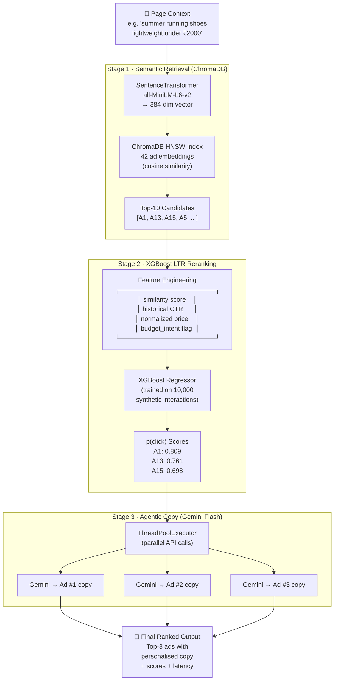
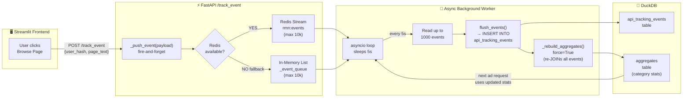
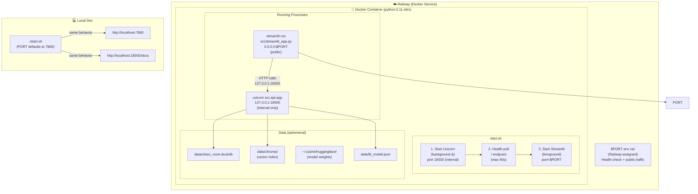

# 🛒 Privacy-Preserving Agentic Retail Media Network (RMN) Engine

> **Built for ShyftLabs AdTech**  
> Real-time on-site advertising with Differential Privacy (DuckDB), Vector Search (ChromaDB), **XGBoost ML Ranking**, and **Agentic LLM Copywriting** (Gemini Flash).

[](https://rmn-engine.up.railway.app)
[](https://diffprivlib.readthedocs.io)
[](http://localhost:8000/docs)
[](https://python.org)
[](https://fastapi.tiangolo.com)

---

## 🎯 Business Problem & ShyftLabs Alignment

Retailers (Myntra, Nykaa, etc.) want to show **personalised ads on their own website** without sending raw user data to advertisers. ShyftLabs solves this with a **Retail Media Network (RMN)** architecture — a Data Clean Room that keeps first-party data private while still enabling smart ad targeting.

| ShyftLabs Real World | This Project Architecture |
|---|---|
| First-party Data Clean Room | **DuckDB** Async Background Worker (Scalable Flush) |
| Mathematical privacy guarantee | **diffprivlib Laplace** mechanism (Persistent DuckDB tracking) |
| Contextual / Semantic match | **ChromaDB** Vector Engine (`all-MiniLM-L6-v2`) |
| Real-time CTR Prediction | **XGBoost** Learning-to-Rank (LTR) |
| Ad Copy Personalization | **Gemini 1.5 Flash** Agentic generation |

---

## 🗺️ Diagram 1 — Master System Architecture

**The complete end-to-end picture: every component and how they connect.**



---

## 🔄 Diagram 2 — Ad Request Flow (Step-by-Step)

**What happens in `< 150ms` when a user clicks "Browse Page & Get Ad".**



---

## 🔐 Diagram 3 — Differential Privacy Pipeline

**How user data is protected at every step in the Clean Room.**



**Key guarantee:** Even if an attacker sees thousands of query outputs, they **cannot determine** whether any single user's data was included — mathematically proven by the ε-DP budget.

---

## 🤖 Diagram 4 — ML Ranking Pipeline

**Three-stage AI pipeline: Vector Search → XGBoost Reranking → LLM Copy.**



---

## 📬 Diagram 5 — Event Ingestion Pipeline

**How user browsing events are asynchronously captured and stored.**



---

## 🐳 Diagram 6 — Deployment Architecture

**How the project runs inside a single Docker container on Railway.**



---

## 🛠 Tech Stack

| Component | Technology | Why |
|---|---|---|
| API Backend | **FastAPI + Uvicorn** | Async execution, background task ingestion |
| Data Clean Room | **DuckDB** | Lightning-fast OLAP on 2.7M rows, persistent DP budget |
| ML Ranking | **XGBoost Regressor** | Learning-to-Rank `p(click)` probability |
| Vector Engine | **ChromaDB (HNSW)** | Scalable cosine similarity, <10ms at 10,000+ ads |
| Agentic LLM | **Gemini 1.5 Flash** | Near-instant hyper-personalized ad copy |
| Embeddings | **all-MiniLM-L6-v2** | CPU-efficient 384-dim sentence embeddings |
| Differential Privacy | **diffprivlib** | IBM Laplace mechanism, persistent daily ε budget |
| Dataset | **Retailrocket (Kaggle)** | 2.7M real e-commerce events |
| Frontend | **Streamlit** | Live demo UI with dark glassmorphism theme |
| Deployment | **Docker + Railway** | Single-container deployment with auto-scaling & $PORT routing |

---

## ⚡ Scale & Performance

| Metric | Target | How |
|---|---|---|
| **Ad Retrieval** | < 10ms | ChromaDB HNSW approximate nearest neighbor |
| **ML Reranking** | < 1ms | XGBoost compiled model (`ltr_model.json`) |
| **LLM Copy** | ~80ms | Parallel Gemini Flash calls via ThreadPoolExecutor |
| **End-to-End** | < 150ms p95 | Async FastAPI + cached embeddings |
| **Catalog Scale** | 10,000+ ads | HNSW index with zero latency degradation |
| **Privacy Budget** | ε ≤ 0.9/day | DuckDB-persisted budget, resets daily |

---

## 🔐 Differential Privacy Math

Every aggregate query on user data has **Laplace noise** mathematically injected:

$$\mathcal{M}(x) = x + \text{Lap}\!\left(\frac{\Delta f}{\varepsilon}\right)$$

- **ε = 0.1** per noise application (3 noisy values = 0.3ε per ad request)
- **ε_max = 0.9** — queries are hard-blocked beyond this  
- **Attack Protection:** The `ε_used` state is stored **persistently in DuckDB**. A malicious attacker cannot restart the server to restore budget and extract raw PII — the budget survives reboots.

---

## 🚀 Local Run Instructions

**Step 1 — Clone & install dependencies**
```bash
git clone https://github.com/shubhamkya/rmn-engine
cd rmn-engine
pip install -r requirements.txt
```

**Step 2 — Set API Key**
Create a `.env` file:
```env
GEMINI_API_KEY=your_api_key_here
```

**Step 3 — One-command startup**
```bash
./start.sh
```

This automatically starts **FastAPI on port 8000** (background) and **Streamlit on port 7860** (foreground).

| Service | URL |
|---|---|
| 🖥️ Streamlit UI | http://localhost:7860 |
| ⚙️ FastAPI Swagger | http://localhost:8000/docs |

---

## 📁 Repository Structure

```
rmn-engine/
├── data/                        # Auto-generated at runtime
│   ├── clean_room.duckdb        # DuckDB database (2.7M events + aggregates)
│   ├── ltr_model.json           # Trained XGBoost model
│   └── chroma/                  # ChromaDB vector index (42+ ad embeddings)
│
├── src/
│   ├── config.py                # 🔧 All constants, API keys, ad catalogue
│   ├── api.py                   # ⚡ FastAPI app + async background worker
│   ├── clean_room.py            # 🦆 DuckDB schema, DP queries, budget tracking
│   ├── embeddings.py            # 🧠 SentenceTransformer + ChromaDB integration
│   ├── ltr.py                   # 📈 XGBoost LTR trainer & inference
│   ├── ranking.py               # 🎯 Full ranking pipeline (Chroma → XGB → LLM)
│   ├── agent.py                 # ✨ Gemini Flash agentic copy generation
│   └── streamlit_app.py         # 🖥️ 4-tab Streamlit dashboard
│
├── Dockerfile                   # 🐳 Railway Docker container
├── start.sh                     # 🚀 Startup orchestration script
├── requirements.txt             # 📦 Python dependencies (CPU-optimized)
└── README.md
```

---

## 📊 Data Flow Summary

```
User browses page
      │
      ▼
POST /track_event ──► In-Memory Queue ──► [every 5s] ──► DuckDB
      │                                                       │
      ▼                                                       ▼
GET /get_ad                                          Rebuild Aggregates
      │
      ├─► DuckDB ──► Laplace DP ──► Noisy Category Stats
      │                                      │
      ├─────────────────────────────────────►│
      │                                      ▼
      │                            SentenceTransformer
      │                            (encode context vector)
      │                                      │
      │                                      ▼
      │                            ChromaDB HNSW Query
      │                            (Top-10 semantic matches)
      │                                      │
      │                                      ▼
      │                            XGBoost LTR Scoring
      │                            (p(click) per candidate)
      │                                      │
      │                               ┌──────┴──────┐
      │                               ▼             ▼
      │                         Gemini #1      Gemini #2,3
      │                         (parallel copy generation)
      │                               └──────┬──────┘
      │                                      │
      ◄──────────────────────────────────────┘
              Top-3 Ranked Ads + Personalized Copy
              + latency_ms + epsilon_used + ctr_lift_pct
```
