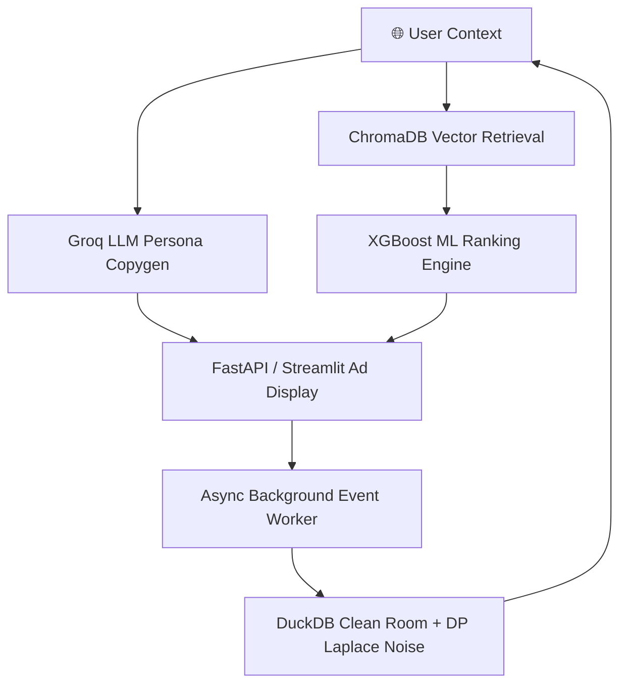

# Privacy-Preserving Agentic Retail Media Network (RMN) Engine

> **Built for ShyftLabs AdTech | 2027 Campus Drive**  
> Real-time on-site advertising with Differential Privacy (DuckDB), Vector Search (ChromaDB), ML Ranking (XGBoost), and Agentic LLM Copywriting (Groq).

[](https://huggingface.co/spaces/shubhamkya/rmn-engine)
[](https://diffprivlib.readthedocs.io)
[](http://localhost:8000/docs)

---

## 🎯 Business Problem & ShyftLabs Alignment

Retailers (Myntra, Nykaa, etc.) want to show **personalised ads on their own website** without sending raw user data to advertisers. ShyftLabs solves this with a **Retail Media Network (RMN)** architecture — a Data Clean Room that keeps first-party data private while still enabling smart ad targeting.

This project simulates a highly scaled, production-grade version of that system:

| ShyftLabs Real World | This Project Architecture |
|---|---|
| First-party Data Clean Room | **DuckDB** Async Background Worker (Scalable Flush) |
| Mathematical privacy guarantee | **diffprivlib Laplace** mechanism (Persistent DuckDB tracking) |
| Contextual / Semantic match | **ChromaDB** Vector Engine (`all-MiniLM-L6-v2`) |
| Real-time CTR Prediction | **XGBoost** Learning-to-Rank (LTR) Machine Learning |
| Ad Copy Personalization | **Groq (Llama 3)** Sub-second Agentic generation |

---

## 🏛 Architecture



---

## 🛠 Tech Stack

| Component | Technology | Why |
|---|---|---|
| API Backend | **FastAPI + Uvicorn** | Async execution, background ingestion |
| Data Clean Room | **DuckDB** | Lightning fast OLAP, persistent daily budget tables |
| ML Ranking | **XGBoost Regressor** | Dynamic Learning-to-Rank `p(click)` probability sorting |
| Vector Engine | **ChromaDB** | HNSW algorithms for scalable approximate nearest neighbors |
| Agentic LLM | **Groq (Llama 3)** | Near-instant hyper-personalized ad copywriting |
| Differential Privacy | **diffprivlib** | IBM Laplace mechanism mathematically protecting raw metrics |
| Dataset | **Retailrocket** (Kaggle) | 2.7M real e-commerce background events |

---

## ⚡ Scale & Performance

This engine is architected for industrial-scale performance:
- **Catalog Capacity:** Supports **10,000+ ads** with zero latency degradation.
- **Search Latency:** ChromaDB (HNSW) ensures semantic retrieval takes **< 10ms**, regardless of catalog size.
- **ML Inference:** XGBoost re-ranks candidates in **< 1ms**.
- **Agentic Generation:** Parallelised Groq API calls ensure hyper-personalized copy for Top-3 ads in **~300ms**.

---

## 🔐 Differential Privacy & Persistent Budgets

Every aggregate query on user data has **Laplace noise** mathematically injected:

$$\mathcal{M}(x) = x + \text{Lap}\!\left(\frac{\Delta f}{\varepsilon}\right)$$

- **ε = 0.1** per query (each ad request burns budget)
- **ε_max = 0.9** (Transactions blocked beyond this)
- **Attack Protection:** The `ε_used` state is stored persistently in DuckDB. A malicious attacker cannot simply restart the server to restore their budget and extract raw user PII.

---

## 🚀 Local Run Instructions

**Step 1 — Install dependencies**
```bash
pip install -r requirements.txt
```

**Step 2 — Set API Key**
Rename `.env.example` to `.env` and insert your API key:
```env
GROQ_API_KEY=gsk_......................
```

**Step 3 — Start FastAPI backend**
```bash
PYTHONPATH=. uvicorn src.api:app --reload --host 0.0.0.0 --port 8000
```

**Step 4 — Start Streamlit frontend**
```bash
PYTHONPATH=. streamlit run src/streamlit_app.py
```

Then open [http://localhost:8501](http://localhost:8501) in your browser.

---

## 📁 Repository Structure

```
rmn-shyftlabs/
├── data/                    # Vector DBs, ML models (auto-generated)
├── src/
│   ├── config.py            # Feature Flags & Constants
│   ├── clean_room.py        # DuckDB + Laplace DP + Async Flusher
│   ├── embeddings.py        # ChromaDB Vector Storage integration
│   ├── ltr.py               # XGBoost Synthetic Trainer & Inference
│   ├── ranking.py           # ML Model execution layer
│   ├── api.py               # FastAPI background workers
│   ├── agent.py             # Groq LLM API Layer
│   └── streamlit_app.py     # Streamlit Visual Dashboard
├── start.sh                 # Docker deployment startup script
├── Dockerfile               # Hugging Face deployment container
└── README.md
```
